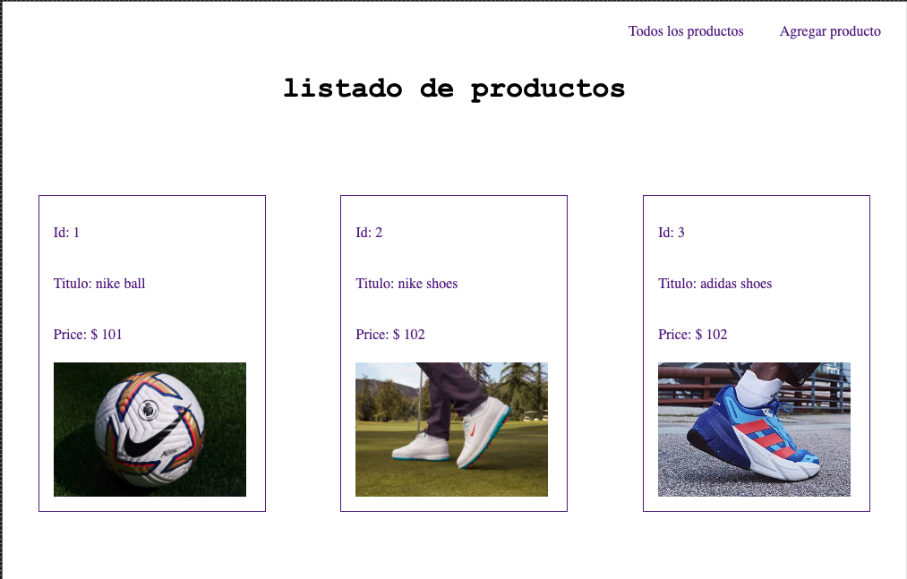
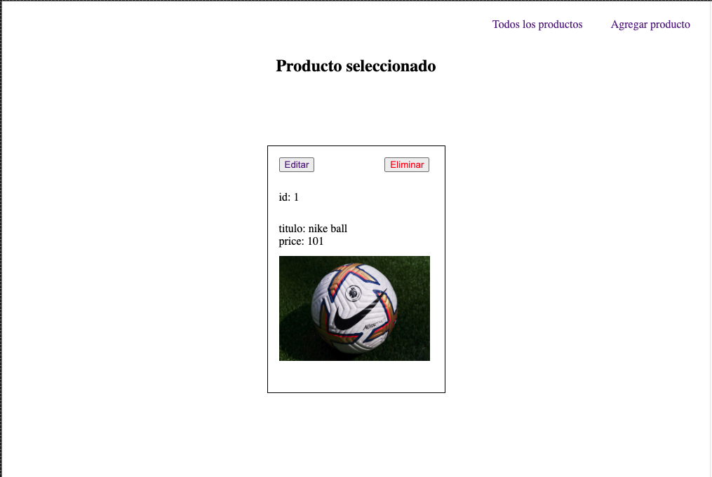

# Backend
Node Express Ejs

Proyecto en Node, utilizando express y motorgrafico de plantilla Ejs

Consiste en un sitio donde encontraremos productos, donde se podran editar, eliminar, o agregar mas elementos.

# Instrucciones de ejecucion

En el directorio raiz puede utilizar el script npm run dev, este ejecutara nodemon index.js, el cual ante cualquier cambio, refrescara automaticamente.

Metodos

+ GET http://localhost:8080/products
+ GET http://localhost:8080/:id
+ GET http://localhost:8080/edit/:id
+ GET http://localhost:8080/form
+ POST http://localhost:8080/:id
+ PUT http://localhost:8080/:id

